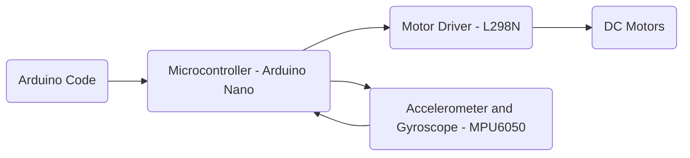

# Overview

The self-balancing robot is a beginner project which allows members to build a segway-like robot which is capable of maintaining its balance while in motion.
Through this project, members will gain basic skills in CAD design, 3D printing/laser cutting, electronic assembly, hardware/software interfacing and PID control systems.

<video src="http://127.0.0.1:4000/assets/clip_1.mp4" controls="controls" style="max-width: 730px;">
</video>

- VIDEO IS NOT WORKING!!!....

## Parts
- Arduino Nano
- L298N Motor Driver Module
- MPU6050 (Accelerometer and Gyroscope)
- 2 DC Geared Motors with Rubber Wheels
- Breadboard
- Connecting Wires
- Power Supply
- Chassis

## Basic Implementation
Creating the self-balancing robot will consist of 3 main parts: the hardware, software, and chassis. 

In this project, we will be using an Arduino Nano as our microcontroller and connecting the 2 DC motors (through the L298N motor driver) to it. We will also be interfacing the MPU6050 to the microcontroller.

For the software, we will be writing in Arduino code (C++ with a few additional features) using the Arduino Integrated Development Environment (IDE).

Lastly, the chassis will be designed using CAD software (Fusion) and laser cut and/or 3D printed depending on your design.

---
[Just the Docs]: https://just-the-docs.github.io/just-the-docs/
[GitHub Pages]: https://docs.github.com/en/pages
[README]: https://github.com/just-the-docs/just-the-docs-template/blob/main/README.md
[Jekyll]: https://jekyllrb.com
[GitHub Pages / Actions workflow]: https://github.blog/changelog/2022-07-27-github-pages-custom-github-actions-workflows-beta/
[use this template]: https://github.com/just-the-docs/just-the-docs-template/generate
